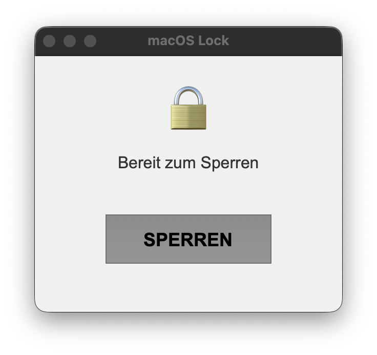

# macOS Lock

[](https://github.com/pepperonas/macOS-lock/actions/workflows/tests.yml)
[](https://www.python.org/downloads/)
[](https://www.apple.com/macos/)
[](LICENSE)

A security utility for macOS that temporarily locks keyboard and mouse input to prevent unauthorized access or accidental input.



## Features

- **Input Locking** - Blocks all keyboard and mouse input when activated
- **Configurable Unlock Shortcut** - Set your own key combination to unlock (default: `X + C`)
- **Silent Unlock** - Unlocking via shortcut keeps the app minimized in the dock
- **Settings Dialog** - Change the unlock shortcut directly in the app
- **GUI & CLI** - Graphical interface or command-line usage
- **Lightweight** - Minimal resource usage, uses macOS native Quartz Event Services

## Installation

### Download Pre-built App

Download the latest release for Apple Silicon / Intel from the [Releases page](https://github.com/pepperonas/macOS-lock/releases).

1. Download `macOS-Lock.app.tar.gz`
2. Extract the archive
3. Move `macOS-Lock.app` to your Applications folder
4. Right-click and select "Open" the first time to bypass Gatekeeper

### Build from Source

**Prerequisites:** macOS 10.14+, Python 3.10+

```bash
git clone https://github.com/pepperonas/macOS-lock.git
cd macOS-lock
pip3 install PyQt6 pyobjc-core pyobjc-framework-Cocoa pyobjc-framework-Quartz
```

Grant accessibility permissions: System Settings > Privacy & Security > Accessibility > add Terminal/Python.

## Usage

### GUI Version (Recommended)

```bash
python3 macos-lock-gui.py
```

- Click **SPERREN** to lock input
- Press your configured shortcut (default `X + C`) to unlock silently
- Click the settings link to change the unlock shortcut

### CLI Version

```bash
python3 macos-lock.py
```

Locks input immediately. Press the configured shortcut to unlock and exit.

### Creating a macOS App Bundle

```bash
./create_app.sh
```

The app will be created in the current directory.

## Configuration

The unlock shortcut is stored in `~/.macos-lock-config.json`:

```json
{
  "unlock_keys": ["x", "c"]
}
```

Change it via the GUI settings dialog or edit the file directly. Supported keys: all letters (`a`-`z`), digits (`0`-`9`), and special keys (`space`, `return`, `tab`, `escape`, `delete`).

## How It Works

The utility uses macOS Quartz Event Services to intercept and block input events at the system level:

1. All keyboard and mouse events are intercepted via an Event Tap
2. Only the configured unlock key combination is monitored
3. Other applications continue running normally
4. Upon unlock, normal input is restored and the app stays minimized

## Running Tests

```bash
pip install pytest
python -m pytest tests/ -v
```

## Troubleshooting

**"Event Tap could not be created"**
- Ensure accessibility permissions are granted
- Restart Terminal/Python after granting permissions

**App doesn't respond**
- Force quit using Activity Monitor
- Or use SSH/remote access to kill the process

## License

MIT License

## Author

Created by [pepperonas](https://github.com/pepperonas)
